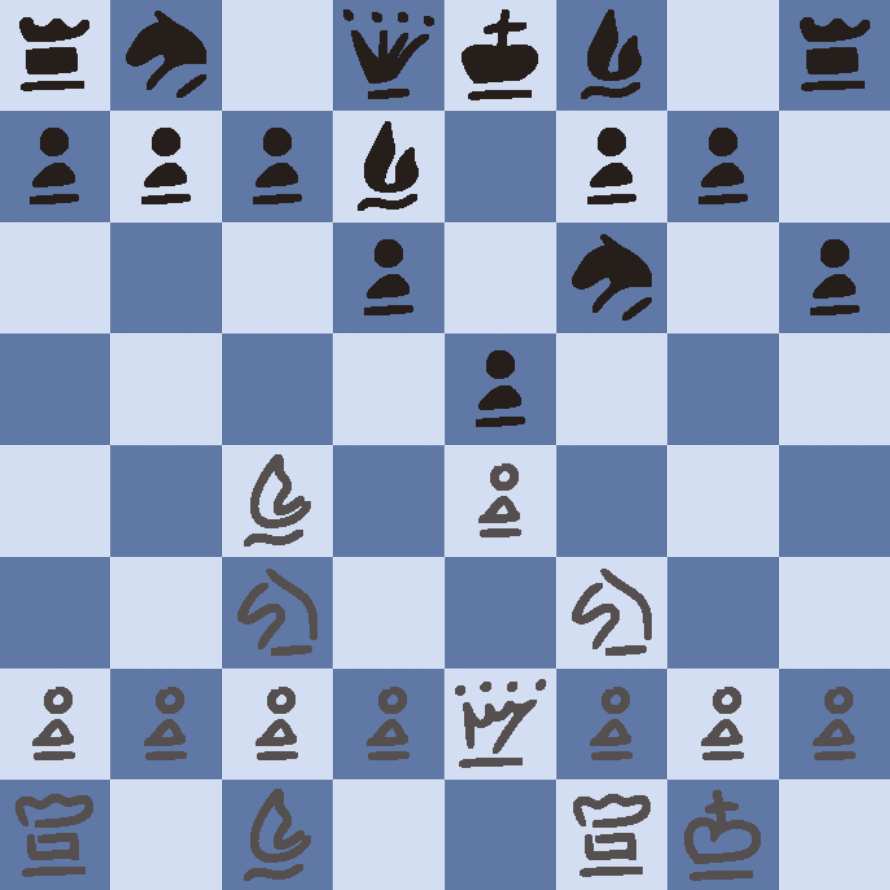

<h1>Chess JS </h1>

As a challenge to test our understandment of JS, DOM manipulation and CSS during the _Nology course we were asked to build a game. This were the specificications for the project:
<ul>
    <li>A fully functioning game;</li>
    <li>build with JS, HTML and CSS/SASS;</li>
    <li>deployed on GitHup pages;</li>
    <li>made at least 15 meaningful commits;</li>
    <li>code formatted correctly;</li>
    <li>build with a mobile first approach;</li>
</ul>

<h2>Table of contents</h2>
<ul>
    <li>General Info</li>
    <li>Technologies</li>
    <li>Setup</li>
    <li>Status</li>
    <li>Future development</li>
</ul>

<h2>General Info</h2>

A fully working chess game, which includes this features:

<ul>
    <li>Castling and en-passant;</li>
    <li>allowed moves ared displayed in green when a piece is clicked;</li>
    <li>if no moves are displayed when cliclimg a piece moving it would cause a check;</li>
</ul>

<h2>Technologies</h2>

The game was built with:

<ul>
    <li>Javascript</li>
    <li>HTML</li>
    <li>CSS / SASS</li>
</ul>

<h2>Setup</h2>

Just access the game on GitHub pages <a href="https://martinelli-89.github.io/ChessJS/">(Chess JS)</a> and have fun!

<h2>Status</h2>

The game is fully working, however it can only be played by two players.
 

<h2>Future developement</h2>
I would like to work on the following features when I will have the knowledge or the time:
<ul>
    <li>Add scores and clearly displayed whos turn it is;</li>
    <li>Add a basic AI for single player</li>
    <li>Add a feature to change the color of the board</li>
</ul>

<h5>Thanks for checking my game. If you find any bug I didn't notice or have any suggestion please reach out :)<h5>